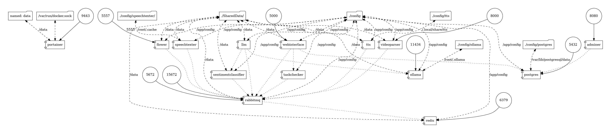

# Introduction

The project is composed of microservices, which are interconnected through a message queue architecture. Each service listens for a specific queue, executes the assigned task, and returns the output.️

Here is a diagram of the architecture:



## Services

Currently there are 10 services:

- **RabbitMQ**: RabbitMQ is a message broker. It is used to send messages between the services. It is the central piece of the architecture.
- **Celery**: Celery is a distributed task queue. It is used to execute tasks asynchronously. It is composed of a message broker (RabbitMQ) and workers (Celery workers). The workers are the ones that execute the tasks. The message broker is the one that sends the tasks to the workers. The workers are the ones that execute the tasks. The message broker is the one that sends the tasks to the workers.
- **Ollama**: Ollama is a service that can easily inference Large Language Models (LLMs) using Dockerimage like structure. It is used to perform the local inference of the LLMs.
- **[WebInterface](#)**: The web interface is the entry point of the application. It is a web application that allows the user to interact with the system. It is built with Flask and sends requests Celery workers.
- **[SpeechTexter](#speechtexter)**: The speech texter is a service that converts speech to text. It communicates with the reqired APIs to perform the conversion.
- **[VideoParser](#videoparser)**: The video parser is a service that processes a given video.
- **[LLM](#llm)**: The LLM is a service that receives a text and produces a summary of it. It communicates with the reqired 3rd or 1st party APIs (such as Ollama) to perform the conversion.
- **Database**: The database is a PostgreSQL database. It is used to store the data of the application.
- **Adminer**: Adminer is a web application that allows the user to interact with the database. It is built with Flask and sends requests Celery workers.

### SpeechTexter

#### Usage

SpeechTexter is a service that converts speech to text. It communicates with the reqired APIs to perform the conversion.

##### Tasks

###### Speech2Text

```python

# speech_texter/tasks.py

def speech2text(

input_file_path,

language_code="en-US",

model_name=config["speechtexter"]["model_name"],

):
...

```

this method is used to convert speech to text. It receives the path of the input file, the language code of the input file, and the model name. It returns the text. can be called like this:

```python

res = celery_app.send_task("speech2text", args=["path/to/input/file"])

print(res.get())

```

> currently, the only supported model is `local`. This means that the conversion is done locally using sphinx.

### VideoParser

#### Usage

VideoParser is a service that handles the processing of a video.

##### Tasks

###### convert_video_to_mp3

```python

# VideoParser/tasks.py

def convert_video_to_mp3(input_filepath):

...

```

this method is used to convert a video to an mp3 file. It receives the path of the input file. It returns the path of the output file. can be called like this:

```python

res = celery_app.send_task("convert_video_to_mp3", args=["path/to/input/file"])

print(res.get())

```

###### youtube_dl

```python

@app.task(name="youtube_dl", bind=True)
def youtube_dl(self, url):
# Self is used to access the celery task context. It is used to update the state of the task.

...

```

This method is used to download a video from youtube. It receives the url of the video. It returns the path of the output file. can be called like this:

```python

res = celery_app.send_task("youtube_dl", args=["https://www.youtube.com/watch?v=video_id"])

print(res.get())

```

### LLM

#### Usage

LLM service is an interface to the LLMs. It receives a text and sends it to the LLM. It then returns the output of the LLM.

##### Supported LLMs

- [Ollama (Local Model)](https://ollama.ai/)
- [Open-AI GPT-* Models](https://openai.com/gpt-4)
- [Google Bard](https://bard.google.com/)

##### Config

> :warning: This service currently not supporting the configuration from yml file. It is hard coded in the code. This will be fixed in the future.

##### Tasks

###### summarize

```python

# LLM/tasks.py

    @app.task(name="summarize")
    def summarize(text):
        ...
        
```

this method is used to summarize a text. It receives the text. It returns the summary. can be called like this:

```python

res = celery_app.send_task("summarize", args=["text"])

print(res.get())

```
